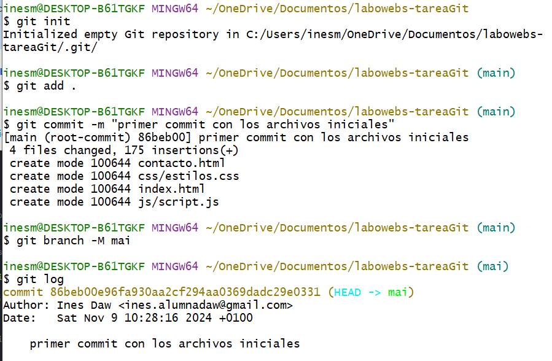

# Ejercicio de Git - proyecto labowebs

> Módulo: Despliegue de Aplicaciones Web
>
> Realizado por: Inés

[TOC]

## Trabajo en local

 1. Inicializa un nuevo repositorio, renombra la rama, agrega archivos y realiza el primer commit.

```bash
# Crea la carpeta y navega a ella
mkdir labowebs
cd labowebs

# Inicializa el repositorio
git init

# Agrega todos los archivos del aula virtual al repositorio y realiza el primer commit
git add .
git commit -m "Primer commit con los archivos iniciales"

# Renombra la rama 'master' a 'main' (si es necesario)
git branch -M main

# Muestra el log del repositorio
git log
```


